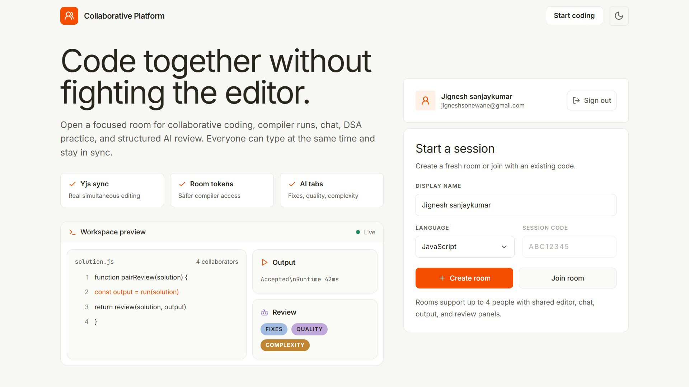
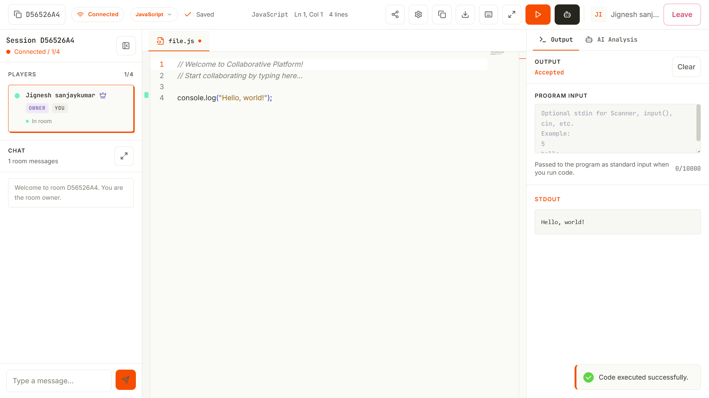
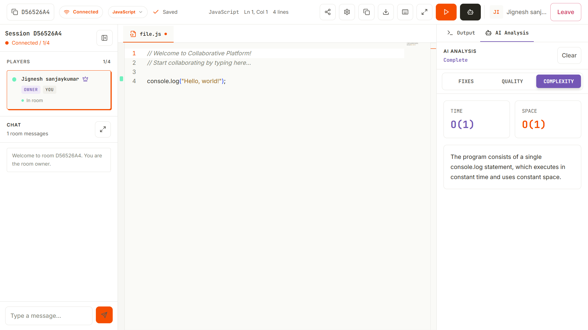

# Collaborative Platform

A focused workspace for people who need to write code together in real time: interviews, classrooms, pair programming, hackathon teams, and quick review sessions.

Collaborative Platform gives each room a shared Monaco editor, live cursors, chat, owner controls, runnable code, structured AI review, and a small DSA practice flow. The important bit is that editing is not last-write-wins anymore: room text is merged through Yjs so multiple people can type at the same time without wiping each other out.

## Screenshots

### Home



### Join Room


### Code Compile



### Complexity Analysis



### AI Quality Analysis


## Why It Matters

Most lightweight collaborative editors fall apart at the exact moment two people type together. This project is built around that moment. The editor uses CRDT document updates over the existing Socket.IO connection, while room presence, chat, roles, compiler access, and problem workflow stay on the same real-time channel.

The result is a small but serious collaborative coding room:

* everyone in the room can edit at the same time
* remote cursors move independently from text updates
* compiler runs are protected by room-issued execution tokens
* AI feedback is structured into fixes, quality, and complexity
* owners can pause, unpause, kick, transfer ownership, and manage problems
* the interface supports polished light and dark modes

## Feature Snapshot

* Real-time collaborative Monaco editor powered by Yjs
* Socket.IO rooms with live roster, chat, cursor presence, and ownership
* Short room codes for quick create/join flows
* Room owner controls: pause, unpause, kick, transfer ownership
* JDoodle code execution for supported languages
* OpenRouter AI analyzer with tabbed structured output
* Built-in DSA problem selection, reset, submit, and solved flow
* Supabase auth support for signed-in AI analysis
* Optional Supabase server-side persistence for rooms, members, chat, snapshots, and solved records
* Professional responsive UI with light and dark themes

## Stack

| Area                 | Tech                                                                    |
| -------------------- | ----------------------------------------------------------------------- |
| Client               | React 18, Vite, Tailwind CSS, Monaco Editor, y-monaco, Socket.IO client |
| Server               | Node.js, Express, Socket.IO, Yjs, Helmet, rate limiting                 |
| Compiler             | JDoodle API                                                             |
| AI review            | OpenRouter                                                              |
| Auth and persistence | Supabase, optional service-role-backed persistence                      |
| Tooling              | Node test runner, Supertest, ESLint                                     |

## Project Layout

```text
client/
  src/
    pages/Home.jsx          # lobby and room entry
    pages/Editor.jsx        # collaborative IDE workspace
    components/             # panels, auth, chat, output, analysis, users
    constants/              # languages and boilerplates
    styles/pixel.css        # design tokens and shared UI classes
server/
  index.js                  # Socket.IO room lifecycle and realtime events
  routes/index.js           # HTTP API routes
  providers/                # JDoodle and OpenRouter integrations
  collabDocument.js         # Yjs document helpers
  executionToken.js         # room compiler token signing/verification
  validators.js             # shared request and socket validation
  test/                     # route, provider, token, Yjs, and validator tests
```

## How Collaboration Works

```text
Browser Monaco model
  <-> y-monaco binding
  <-> local Y.Doc
  <-> Socket.IO document-update event
  <-> server room Y.Doc
  <-> other room members
```

Normal typing uses `document-update` Yjs deltas. Cursor movement uses separate presence events. This separation keeps collaborator cursors from jumping when someone else types.

The server keeps one `Y.Doc` per active room and sends `documentState` to late joiners. Language changes and problem resets replace the shared Yjs text and broadcast that update to every client.

## Getting Started

### Requirements

* Node.js 18+
* npm
* A browser
* JDoodle credentials for compiler execution
* OpenRouter key for hosted AI analysis
* Supabase project if you want auth or persistence

### Install

```bash
npm run install:all
```

### Environment Files

Create local env files:

```bash
cp server/.env.example server/.env
cp client/.env.example client/.env
```

PowerShell:

```powershell
Copy-Item server/.env.example server/.env
Copy-Item client/.env.example client/.env
```

### Server Environment

`server/.env`:

```env
NODE_ENV=development
PORT=3001
CORS_ORIGINS=http://localhost:5173,http://127.0.0.1:5173

SUPABASE_URL=https://your-project.supabase.co
SUPABASE_SERVICE_ROLE_KEY=your-service-role-key-here

EXECUTION_TOKEN_SECRET=change-this-to-a-long-random-value

JDOODLE_CLIENT_ID=your_client_id_here
JDOODLE_CLIENT_SECRET=your_client_secret_here

OPENROUTER_API_KEY=your_openrouter_api_key_here
OPENROUTER_MODEL=deepseek/deepseek-v4-flash
OPENROUTER_FALLBACK_MODELS=
OPENROUTER_HTTP_REFERER=http://localhost:5173
OPENROUTER_APP_TITLE=Collaborative Platform
ANALYSIS_FALLBACK_ON_ERROR=true
```

Notes:

* `SUPABASE_SERVICE_ROLE_KEY` belongs on the server only. Never expose it in the client.
* If the service role key is missing, the app still works in memory; Supabase room persistence is skipped.
* `EXECUTION_TOKEN_SECRET` should stay stable across restarts and server instances so compiler tokens verify consistently.

### Client Environment

`client/.env`:

```env
VITE_SOCKET_URL=http://localhost:3001
VITE_API_URL=http://localhost:3001

VITE_SUPABASE_URL=https://your-project.supabase.co
VITE_SUPABASE_PUBLISHABLE_KEY=your-publishable-key-here
```

## Run Locally

Start the full app from the project root:

```bash
npm run dev
```

Default local URLs:

* Client: `http://localhost:5173`
* Server: `http://localhost:3001`

Run one side at a time:

```bash
npm run server:dev
npm run client:dev
```

## Quality Checks

```bash
npm run server:test
cd client && npm run lint
npm run build
```

The production build intentionally code-splits Monaco into lazy chunks so the lobby stays light.

## API

### `GET /api/create-room`

Returns an eight-character room code.

```json
{ "roomId": "ABC12345" }
```

### `GET /api/health`

Basic server health endpoint for local checks and Render.

### `GET /api/health/details`

Authenticated detailed health response with room and persistence status.

### `GET /api/problems`

Returns the built-in DSA problem list. Requires auth.

### `POST /api/execute`

Runs code through JDoodle. A user must join a room first and send the `executionToken` received in `room-joined`.

```json
{
  "roomId": "ABCD1234",
  "executionToken": "room-issued-token",
  "code": "console.log('hello')",
  "language": "javascript"
}
```

Supported execution languages include JavaScript, TypeScript, Python, Java, C++, Go, and Rust.

### `POST /api/analyze`

Requires Supabase auth. Sends code and optional compiler output to OpenRouter. The response is structured for the tabbed UI:

```json
{
  "fixes": [
    {
      "severity": "warning",
      "title": "Prefer strict equality",
      "description": "Use === instead of == to avoid implicit type coercion."
    }
  ],
  "quality": {
    "score": 82,
    "grade": "B",
    "items": [
      {
        "category": "Readability",
        "comment": "The function names are clear."
      }
    ]
  },
  "complexity": {
    "time": "O(n)",
    "space": "O(1)",
    "explanation": "The code scans the input once and keeps constant extra state."
  }
}
```

If OpenRouter is unavailable and fallback is enabled, the server returns the same shape with local fallback notes.

## Realtime Events

The main room events are:

| Direction        | Event                                                                                        | Purpose                                                           |
| ---------------- | -------------------------------------------------------------------------------------------- | ----------------------------------------------------------------- |
| Client -> server | `join-room`                                                                                  | Join or create a room                                             |
| Server -> client | `room-joined`                                                                                | Initial users, language, Yjs `documentState`, and execution token |
| Client -> server | `document-update`                                                                            | Yjs document delta for collaborative text editing                 |
| Server -> client | `document-update`                                                                            | Yjs delta broadcast to other room members                         |
| Client -> server | `cursor-move`                                                                                | Cursor and selection presence                                     |
| Server -> client | `cursor-updated`                                                                             | Single-user cursor presence delta                                 |
| Server -> client | `presence-removed`                                                                           | Remove a departed user's cursor                                   |
| Client -> server | `language-change`                                                                            | Change language and optionally replace document text              |
| Server -> client | `language-updated`                                                                           | Language and document replacement update                          |
| Client -> server | `chat-message`                                                                               | Send room chat                                                    |
| Server -> client | `chat-received`                                                                              | Receive room chat                                                 |
| Client -> server | `pause-user`, `unpause-user`, `kick-user`, `transfer-ownership`                              | Owner controls                                                    |
| Client -> server | `select-problem`, `select-random-problem`, `reset-problem`, `submit-solution`, `mark-solved` | Problem workflow                                                  |

`code-change` still exists as a legacy compatibility path, but normal typing uses Yjs `document-update`.

## Deployment

The app is split into a Web Service and a Static Site. `render.yaml` contains the Render blueprint.

### Render Backend

Use the server service. Set production env vars in Render:

```env
NODE_ENV=production
PORT=10000
CORS_ORIGINS=https://your-client-domain.onrender.com
SUPABASE_URL=...
SUPABASE_SERVICE_ROLE_KEY=...
EXECUTION_TOKEN_SECRET=...
JDOODLE_CLIENT_ID=...
JDOODLE_CLIENT_SECRET=...
OPENROUTER_API_KEY=...
OPENROUTER_MODEL=deepseek/deepseek-v4-flash
OPENROUTER_HTTP_REFERER=https://your-client-domain.onrender.com
OPENROUTER_APP_TITLE=Collaborative Platform
```

### Render or Static Frontend

Set:

```env
VITE_SOCKET_URL=https://your-server-domain.onrender.com
VITE_API_URL=https://your-server-domain.onrender.com
VITE_SUPABASE_URL=...
VITE_SUPABASE_PUBLISHABLE_KEY=...
```

After changing env vars, redeploy both services. The client build bakes in `VITE_*` values.

## Troubleshooting

### Render does not show my latest changes

Check that the commit was pushed to the GitHub branch Render watches:

```bash
git log -1 --oneline
git branch -vv
git push origin master
```

A local commit is not enough for Render. Render deploys from GitHub.

### Supabase says RLS blocked `rooms` or `room_members`

The backend is using a public key for server writes or the service role key is missing. Add `SUPABASE_SERVICE_ROLE_KEY` to the server environment only, then restart/redeploy.

### `Room execution token rejected`

Rejoin the room after a server restart. Also verify:

* `VITE_API_URL` points to the same server as `VITE_SOCKET_URL`
* `EXECUTION_TOKEN_SECRET` is stable in production
* the room token has not expired

### AI analysis requires sign-in

`POST /api/analyze` is protected by Supabase auth. Configure the client Supabase publishable key and sign in before running analysis.

### Compiler fails

Check JDoodle credentials, selected language support, and JDoodle quota. The output panel shows provider errors when JDoodle returns them.

## Notes For Contributors

* Keep realtime event contracts in sync between `server/index.js` and `client/src/pages/Editor.jsx`.
* Do not put service role keys in client env files.
* Run server tests before changing auth, execution, Yjs sync, or analyzer code.
* Push commits to GitHub before expecting Render to redeploy.
